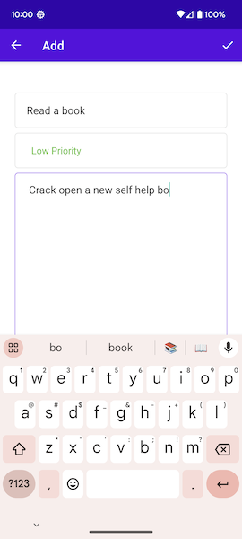

# MyToDos
MyToDos is a robust to-do list application developed in Kotlin. It harnesses key Android architecture components to provide users with a seamless and efficient task management experience.

 &nbsp;&nbsp;&nbsp;&nbsp;&nbsp;&nbsp;&nbsp;&nbsp;  &nbsp;&nbsp;&nbsp;&nbsp;&nbsp;&nbsp;&nbsp;&nbsp; 
## Table of Contents
<details>
  <summary>Table of Contents</summary>
  
- [Learning Outcomes](#learning-outcomes)
- [Future Enhancements](#future-enhancements)
- [Live Demo](#live-demo)
- [Setup](#setup)
- [Credit](#credit)
- [Licenses](#license)
</details>

<a name="learning-outcomes"></a>
## Learning Outcomes
<details open>
  <summary>Learning Outcomes</summary>

  ### Activity and Fragments
* Gain a deep understanding of how **Activities** and **Fragments** work together to create dynamic and interactive user interfaces.
* Learn how **Fragments** can be hosted within **Activities** to create modular and reusable UI components.
### Navigation Components
* Explore how **Navigation Components** simplify the navigation flow between **Fragments** and **Activities**.
* Learn how to design and implement seamless user journeys through your app, enhancing the user experience.
### Safe Args and View Models
* Understand the importance of **Safe Args** in ensuring type-safe data transfer between destinations.
* Explore the role of **ViewModels** in preserving UI-related data during configuration changes and why they are crucial for robust **Android apps**.
### ROOM Database
* Discover the advantages of **ROOM**, a modern data persistence library, and how it simplifies database operations in **Android**.
* Learn how to define Data Access Objects (**DAO**) and **Repositories** to effectively manage and access your app's data.
### Recycler View
* Harness the capabilities of **RecyclerView** to efficiently display dynamic sets of data in the app.
* Explore how **Data Binding**, **Binding Adapters**, and **DiffUtil** work together to optimize **RecyclerView** performance.
### CRUD Operations
* Understand the concept of **CRUD** (Create, Read, Update, Delete) and how it applies to **Fragments**, **Activities**, and **ROOM** database.
* Learn how to implement these fundamental operations for effective data management in your **Android app**.
### Clean Architecture
* Recognize the importance of clean and organized architectural patterns in **Android app development**.
* Learn how to structure your app's codebase for maintainability, scalability, and collaboration. 
</details>

<a name="live-demo"></a>
## Live Demo


Create a new todo and diplay it on your task list

https://github.com/miguel-galvan/MyToDos/app/src/main/res/raw/66977173/05aa36c5-c155-4068-8d8b-cdcbd4aec1ed

Lookup specific todos in list and edit the task

https://github.com/miguel-galvan/MyToDos/app/src/main/res/raw/66977173/2f567f30-961e-4a15-b5fd-1ae537ba4d01

Sort task by priority for convenience, both high and low

https://github.com/miguel-galvan/MyToDos/app/src/main/res/raw/66977173/7282f00f-5cea-4b42-94fa-870675d4bff8

Delete a todo with one of three methos

https://github.com/miguel-galvan/MyToDos/app/src/main/res/raw/66977173/800ced97-dd75-40c1-a1a5-7be8cbed044c

<a name="setup"></a>
## Setup
To get started with MyToDos, follow these steps:
1. Clone the project repository to your local machine:<br>
   ```git clone https://github.com/miguel-galvan/MyToDos.git```
2. Open the project in Android Studio
3. Create an Android emulator or connect a physical Android device.
4. Build and run the application using Android Studio.
<a name="#future-enhancements"></a>
## Future Enhancements
Coming soon! Brainstorming ideas to enhance app!
<a name="credit"></a>
## Credit
This project was completed as part of a Udemy course. You can access the full course and learn more about Android development [here](https://www.udemy.com/course/to-do-app-clean-architecture-android-development-kotlin/).
<a name="license"></a>
## Licenses
